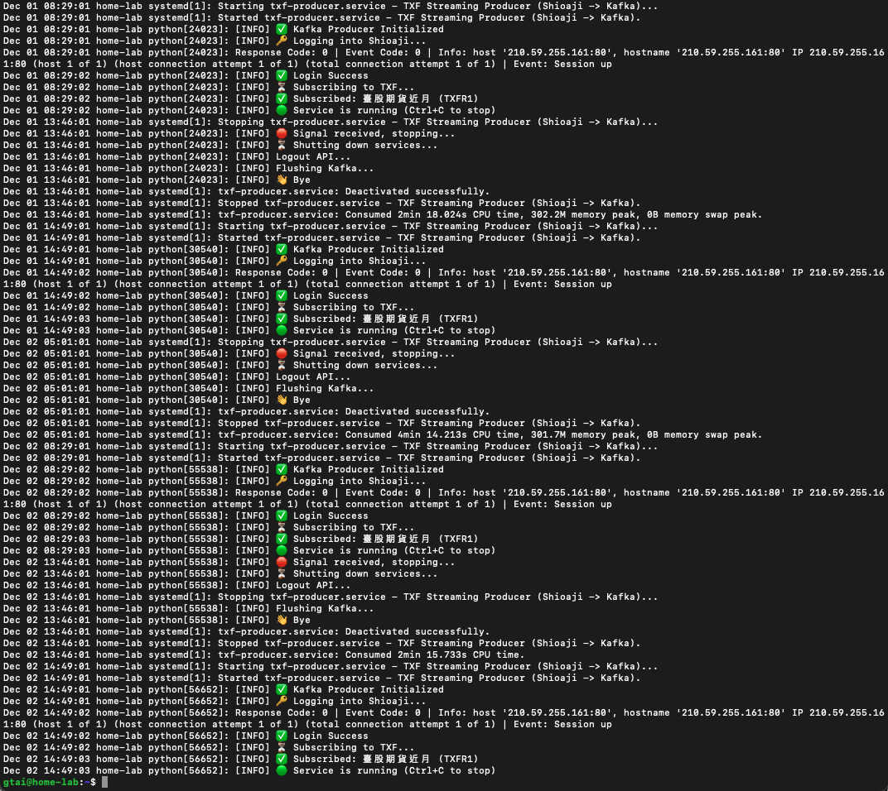

# TXF Streaming Server

這是一個練習高頻交易 (HFT) 資料管線設計的 Python 服務。它使用 **Asyncio** 連接永豐 Shioaji API，將台指期 (TXF) 的 **Tick** 與 **BidAsk** 數據經由 **Google Protobuf** 序列化後，即時推送到 **Apache Kafka**。

-----

## 資料格式 (Data Schema)

本專案使用 **Google Protobuf 3** 定義資料結構。為了在保留小數位數的同時提升序列化效能與壓縮比，所有價格欄位皆採用 **Scaled Integer (x10000)** 儲存。

### 1\. Tick Data (`txf.Tick`)

| Field | Type | Description | Note |
| :--- | :--- | :--- | :--- |
| `code` | string | 商品代碼 | e.g., "TXFR1" |
| `timestamp_ms` | int64 | 時間戳記 | Unix Epoch (ms) |
| `close` | int64 | 成交價 | **Price \* 10000** |
| `volume` | int32 | 單筆量 | |
| `tick_type` | int32 | 內外盤 | 1:外盤 (Buy), 2:內盤 (Sell) |
| `total_volume` | int32 | 當日總量 | 用於檢測封包遺漏 |
| `underlying_price` | int64 | 標的物價格 | Price \* 10000 |

### 2\. BidAsk Data (`txf.BidAsk`)

| Field | Type | Description | Note |
| :--- | :--- | :--- | :--- |
| `bid/ask_total_vol` | int32 | 委託總量 | |
| `bid/ask_price` | repeated int64 | 五檔價格 | List[5], **Price \* 10000** |
| `bid/ask_volume` | repeated int32 | 五檔掛單量 | List[5] |
| `diff_..._vol` | repeated int32 | 掛單變化量 | List[5], 策略訊號用 |

-----

## 快速開始 (Quick Start)

### 1\. 環境準備

建議使用 Python 3.9+ 與虛擬環境：

```bash
git clone https://github.com/gman-quant/txf-streaming-server.git
cd txf-streaming-server
python3 -m venv .venv
. .venv/bin/activate
pip install -r requirements.txt
```

### 2\. Protobuf 編譯

若您修改了 `.proto` 檔，需重新編譯 Python 類別：

```bash
# 確保已安裝 protoc 編譯器
python -m grpc_tools.protoc -I protos --python_out=src protos/txf_data.proto
```

### 3\. 設定檔 (Configuration)

請在專案根目錄下建立 `.env` 檔案，用於儲存 API 憑證與 Kafka 設定：

```python
# .env

# -----------------------------------------------
# 1. Shioaji API 憑證 (請先申請)
# -----------------------------------------------
SHIOAJI_API_KEY=your_api_key_here
SHIOAJI_SECRET_KEY=your_secret_key_here

# -----------------------------------------------
# 2. Kafka 伺服器設定 (請先建立 Kafka Topic)
# -----------------------------------------------
# Kafka Broker 範例: 192.168.1.10:9092 或 多個 broker 用逗號分隔
KAFKA_BOOTSTRAP_SERVERS=kafka_broker_IP:9092
# Topic 名稱範例: txf-tick, txf-bidask
TICK_TOPIC=txf-tick
BIDASK_TOPIC=txf-bidask
```

### 4\. 執行測試

手動執行時，Log 會包含時間戳記；Systemd 執行時則會自動隱藏時間 (Smart Logging)。

```bash
python -m src.txf_producer
```

-----

## 伺服器部署 (Deployment)

本服務設計為 Ubuntu Systemd 背景服務，配合 Crontab 進行自動開關機。

### 1\. Systemd 設定

建立 `/etc/systemd/system/txf-producer.service`：

```ini
[Unit]
Description=TXF Streaming Producer (Shioaji -> Kafka)
Documentation=https://github.com/gman-quant/txf-streaming-server

After=network-online.target kafka.service
Requires=kafka.service
PartOf=kafka.service

[Service]
# 請填入實際的使用者與路徑
User=
Group=
WorkingDirectory=
ExecStart=
Restart=on-failure
RestartSec=5s
Environment=PYTHONUNBUFFERED=1
Environment=LC_ALL=C.UTF-8
Environment=LANG=C.UTF-8
StandardOutput=journal
StandardError=journal

[Install]
WantedBy=multi-user.target
```

### 2\. Crontab 排程 (自動交易時段控制)

設定自動於日盤/夜盤開盤前啟動，收盤後停止：

```bash
sudo crontab -e
```

於文件最下方貼上以下內容：

```nano
# --- Day Session (08:29 Start - 13:46 Stop) ---
29 08 * * 1-5 /bin/systemctl start txf-producer.service
46 13 * * 1-5 /bin/systemctl stop txf-producer.service

# --- Night Session (14:49 Start - 05:01 Stop) ---
49 14 * * 1-5 /bin/systemctl start txf-producer.service
01 05 * * 2-6 /bin/systemctl stop txf-producer.service
```
-----
## 伺服器狀態預覽


-----

## Disclaimer

本專案僅供程式交易研究與教育用途。高頻交易涉及極高風險，使用者需自行承擔 API 連線不穩、報價延遲或系統故障可能導致的損失。